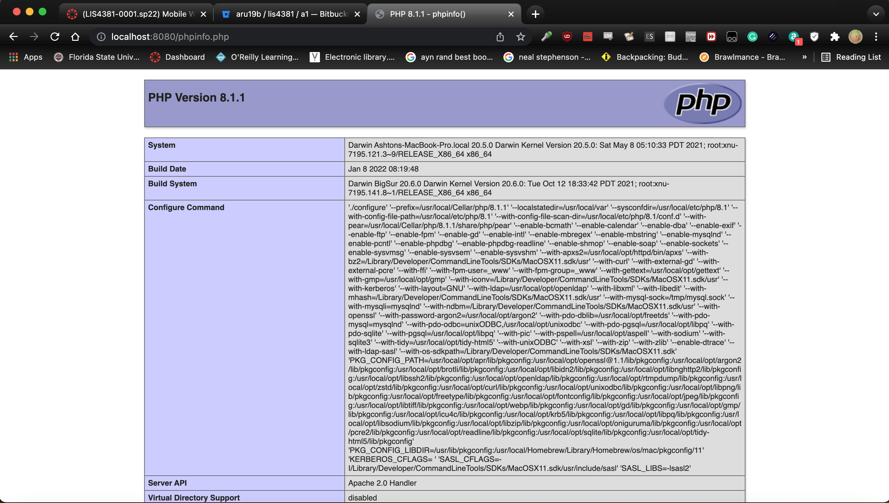
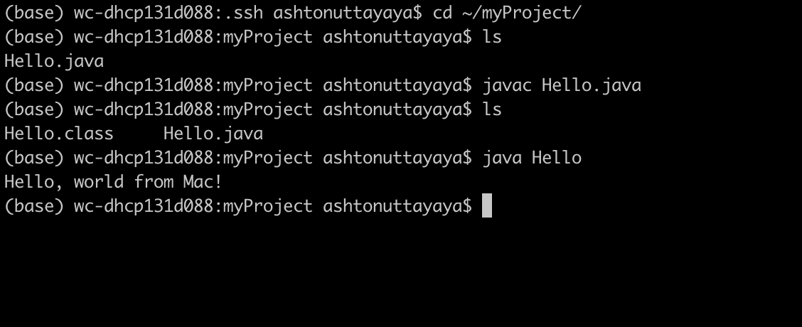
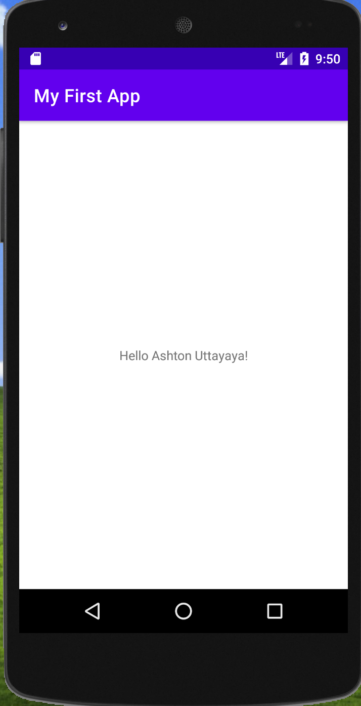

> **NOTE:** This README.md file should be placed at the **root of each of your repos directories.**
>
>Also, this file **must** use Markdown syntax, and provide project documentation as per below--otherwise, points **will** be deducted.
>

# LIS 4381 - Mobile Web App Development

## Ashton Uttayaya

### Assignment 1 Requirements:

*Three Parts:*

1. Distributed Version Control with Git and Bitbucket
2. Development Installation
3. Chapter Questions (Chs 1, 2)

#### README.md file should include the following items:

* Screenshot of AMPPS Installation [My PHP Installation](http://localhost:8080/phpinfo.php)
* Screenshot of running java Hello
* Screemshot of running Android Studio - My First App
* Git Commands with short description
* Bitbuckt repo links: a) [this assignment](https://bitbucket.org/aru19b/lis4381/src/master/) and b) [the completed tutorials](https://bitbucket.org/aru19b/bitbucketstationlocations/src/master/)
 
> #### Git commands w/short descriptions:

1. git init - Creates empty git repo in specified directory, runs with no arguments to initialize current directory as git repo
2. git status - list all staged, unstaged, and untracked files
3. git add - stages specified changes for next commit
4. git commit - commits version being pushed with specified message
5. git push - pushes local branches to remote repository
6. git pull - pulls all changes made on remote repository to local repository
7. git diff - shows unstaged changes between local and remote repository

#### Assignment Screenshots:

#### *Screenshot of AMPPS running*:

#### *Screenshot of running java Hello*:

#### *Screenshot of Android Studio - My First App*:

#### Tutorial Links:

*Bitbucket Tutorial - Station Locations:*
[A1 Bitbucket Station Locations Tutorial Link](https://bitbucket.org/aru19b/bitbucketstationlocations/ "Bitbucket Station Locations")

