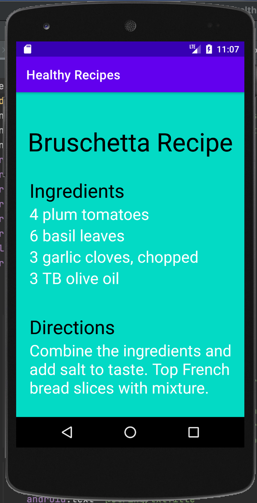

> **NOTE:** This README.md file should be placed at the **root of each of your repos directories.**
>
>Also, this file **must** use Markdown syntax, and provide project documentation as per below--otherwise, points **will** be deducted.
>

# LIS 4381 - Mobile Web App Development

## Ashton Uttayaya

### Assignment 2 Requirements:

*Two Parts:*

1. Create a mobile recipie app using android studio
2. Change background and text colors for each screen
3. Skill sets 1 through 3

#### README.md file should include the following items:

* Screenshot of running application's first user interface
* Screenshot of running application's second user interface

#### Assignment Screenshots:

#### *Screenshots of running both application's user interfaces.*:

Screen 1                   |  Screen 2
:-------------------------:|:-------------------------:
  |  

#### *Screenshots of Skill Sets.:

