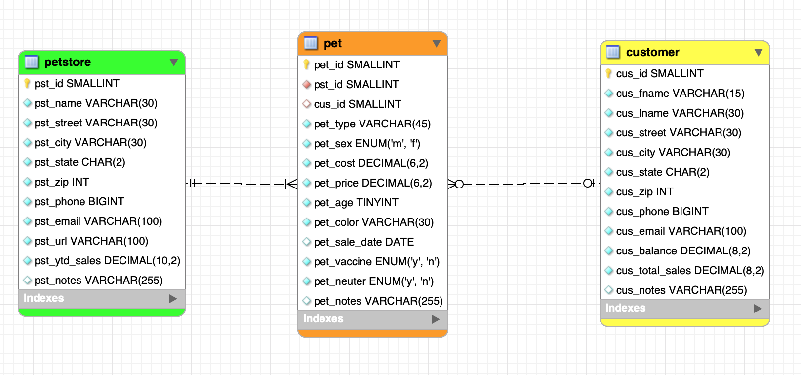
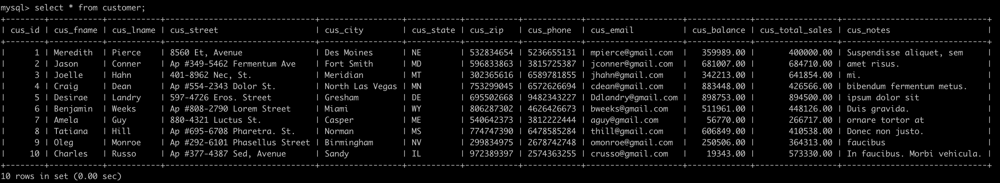
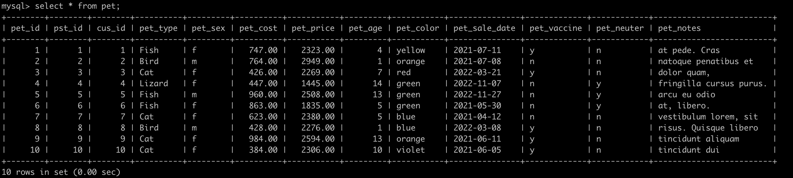
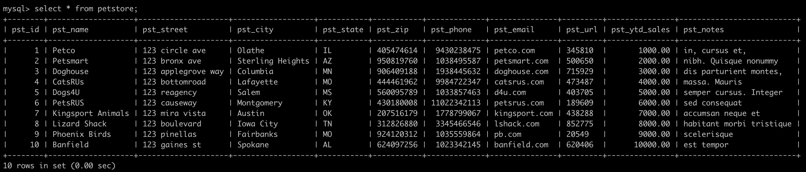
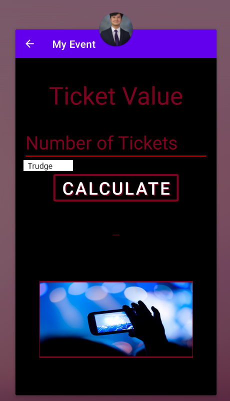
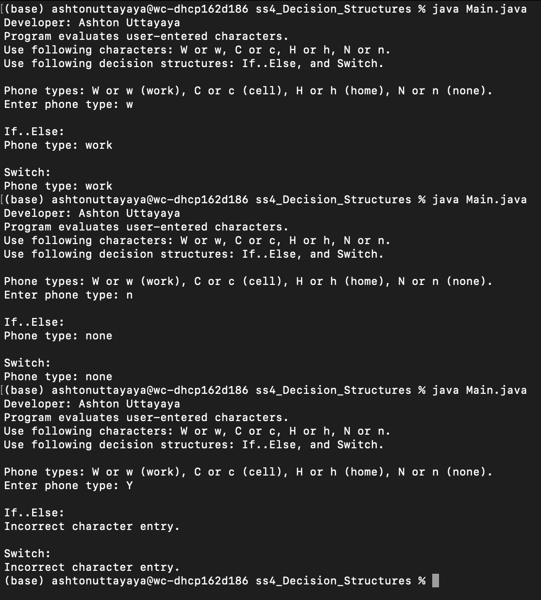
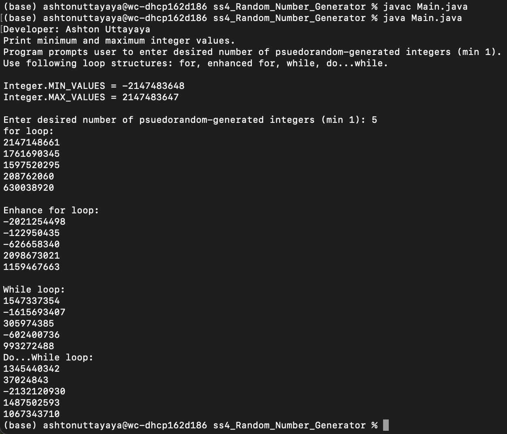
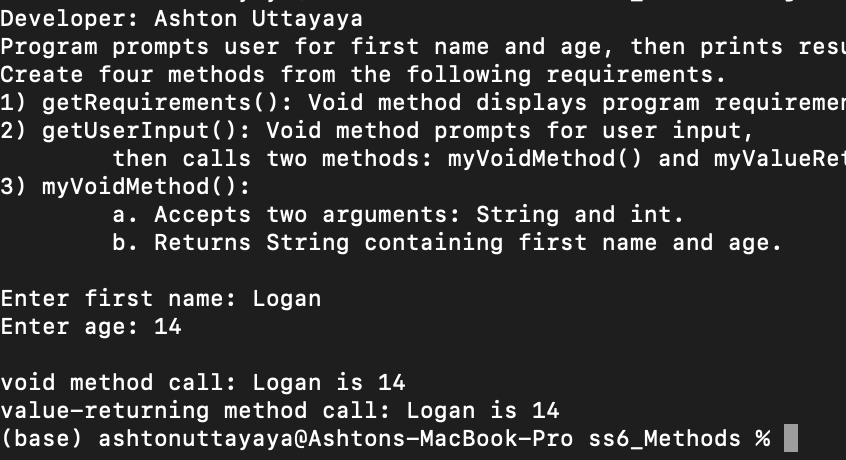

> **NOTE:** This README.md file should be placed at the **root of each of your repos directories.**
>
>Also, this file **must** use Markdown syntax, and provide project documentation as per below--otherwise, points **will** be deducted.
>

# LIS 4381 - Mobile Web App Development

## Ashton Uttayaya

### Assignment 3 Requirements:

*Three Parts:*

1. Create a mobile app for calculating ticket prices for different artists and ticket amounts using android studio
2. Create database using MYSQL DB
3. Skill sets 4 through 6

#### README.md file should include the following items:

* Screenshot of ERD
* Screenshot of running application's opening user interface
* Screenshot of running application's processing user interface
* Screenshot of 10 records for each table for ERD
* Links to [.MWB](files/A3.mwb "My MWB file") and [.SQL](files/a3.sql "My SQL file") files

#### Assignment Screenshots:

#### *Screenshots of Skill Sets.:

ERD Diagram                |
:-------------------------:|
 |

#### *Screenshot of table data.:

Customer Table              |
:-------------------------:|
 |

Pet Table.                 |
:-------------------------:|
 |

Petstore Table             |
:-------------------------:|
 |

#### *Screenshots of running both application's user interfaces.*:

Screen 1                   |  Screen 2
:-------------------------:|:-------------------------:
  |  

#### *Screenshots of Skill Sets.:

Skill Set 4                |
:-------------------------:|
 |

Skill Set 5                |
:-------------------------:|
 |

Skill Set 6                |
:-------------------------:|
 |