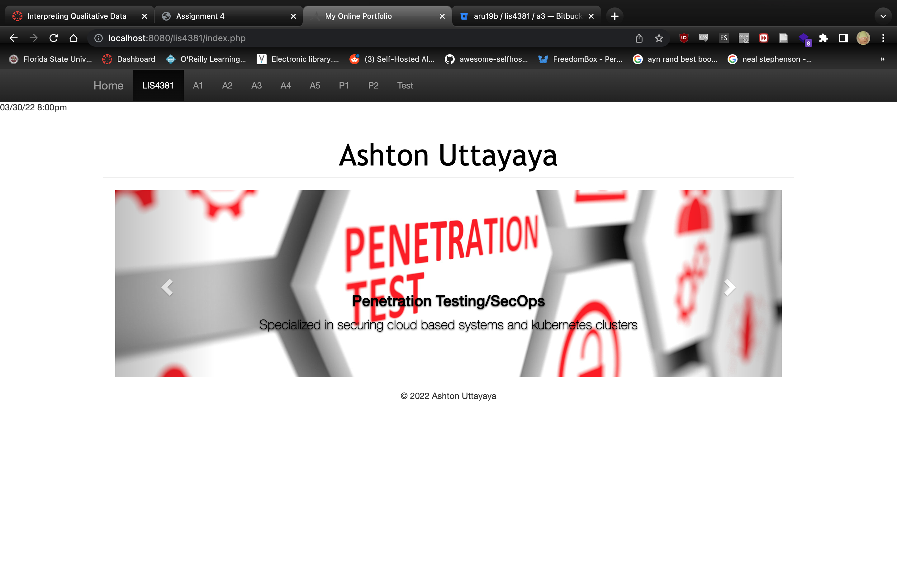
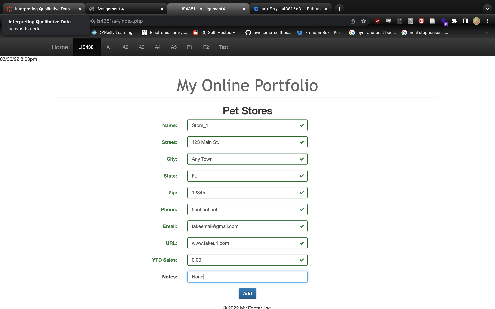
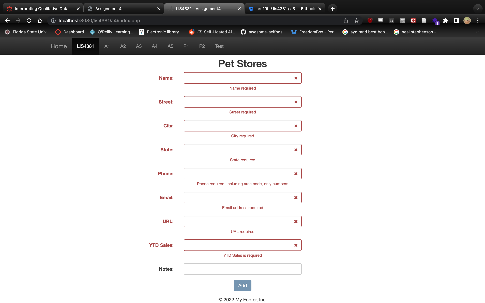
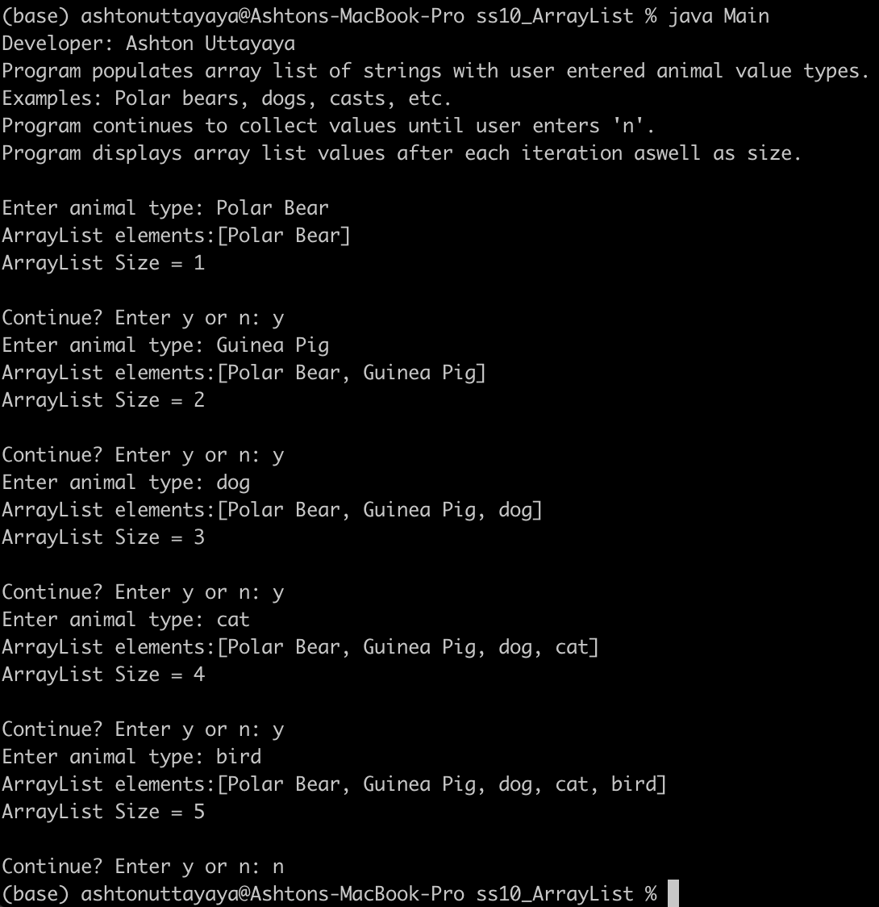
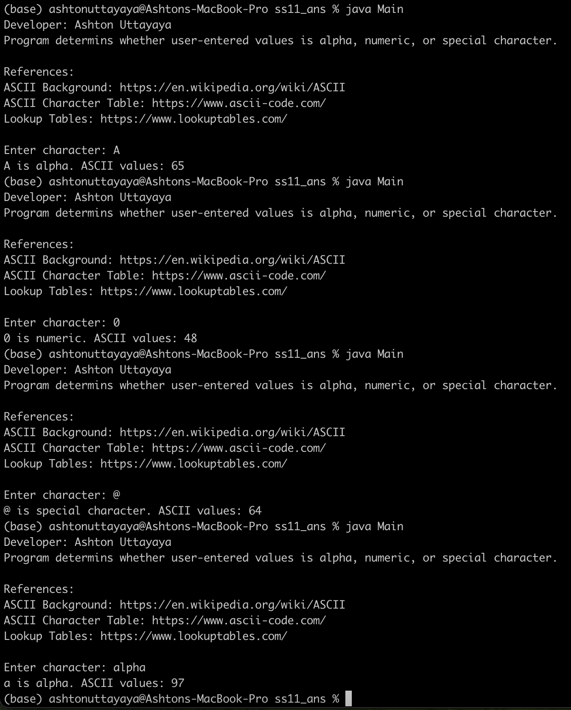
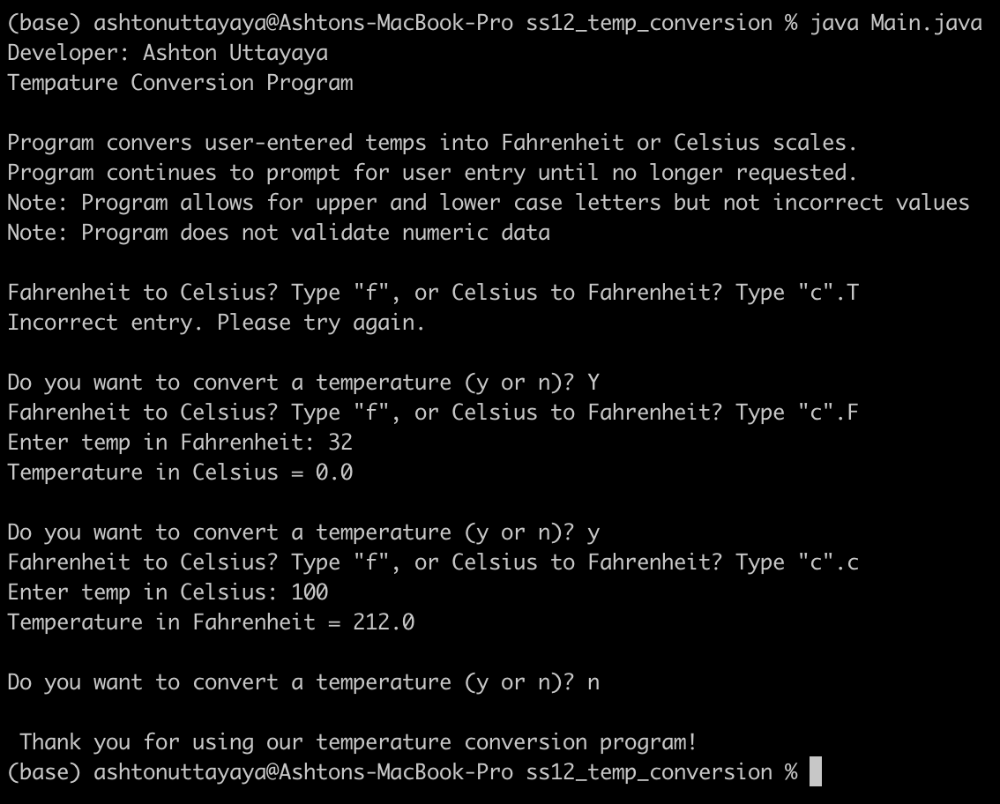

> **NOTE:** This README.md file should be placed at the **root of each of your repos directories.**
>
>Also, this file **must** use Markdown syntax, and provide project documentation as per below--otherwise, points **will** be deducted.
>

# LIS 4381 - Mobile Web App Development

## Ashton Uttayaya

### Assignment 4 Requirements:

*Three Parts:*

1. Create a PHP application
2. Sanitize and validate data for input boxes
3. Skill sets 10 through 12

#### README.md file should include the following items:

* Screenshot of Home Page
* Screenshot of invalid data input
* Screenshot of valid data input
* Screenshot of skill sets

#### Assignment Screenshots:

#### *Screenshots of Skill Sets.:

Home Screen              |
:-------------------------:|
 |

#### *Screenshot of valid and invalid data inputs.:

Valid data            |
:-------------------------:|
 |

Invalid data                |
:-------------------------:|
 |

#### *Screenshots of Skill Sets.:

Skill Set 10                |
:-------------------------:|
 |

Skill Set 11                |
:-------------------------:|
 |

Skill Set 12                |
:-------------------------:|
 |