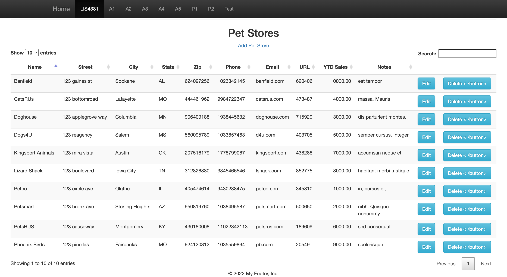

> **NOTE:** This README.md file should be placed at the **root of each of your repos directories.**
>
>Also, this file **must** use Markdown syntax, and provide project documentation as per below--otherwise, points **will** be deducted.
>

# LIS 4381 - Mobile Web App Development

## Ashton Uttayaya

### Assignment 5 Requirements:

*Three Parts:*

1. Create server side validation
2. Publish a database to a webapp
3. Skill sets 13 through 15

[website](http://localhost:8080/lis4381)

#### README.md file should include the following items:

* Screenshot of Home Page
* Screenshot of invalid data input
* Screenshot of valid data input
* Screenshot of skill sets

#### Assignment Screenshots:

#### *Screenshots of Homescreen.:

Home Screen              |
:-------------------------:|
 |

#### *Screenshot of valid data input.:

Valid data                 | Valid input               |
:-------------------------:|:-------------------------:|
 |  |

#### *Screenshot of valid data input.:

Invalid data               | Invalid input               |
:-------------------------:|:-------------------------:|
 |  |

#### *Screenshots of Skill Sets.:

Skill Set 13                |
:-------------------------:|
 |

Skill Set 14 pt 1          | Skill Set 14 pt 2          |
:-------------------------:|:-------------------------:|
 |  |

Skill Set 15                | Skill Set 15 pt 2          |
:-------------------------:|:-------------------------:|
 |  |