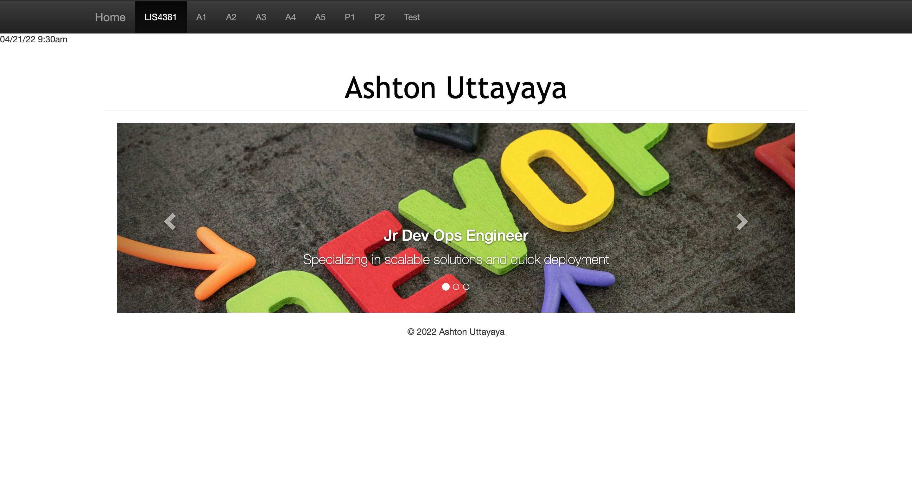
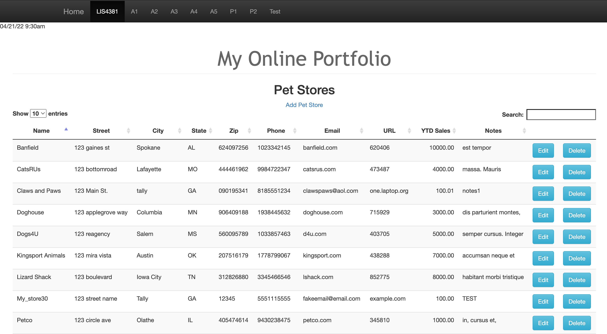
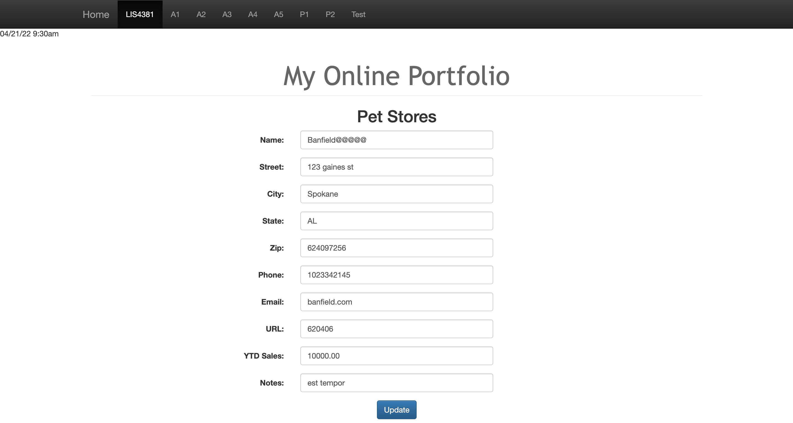
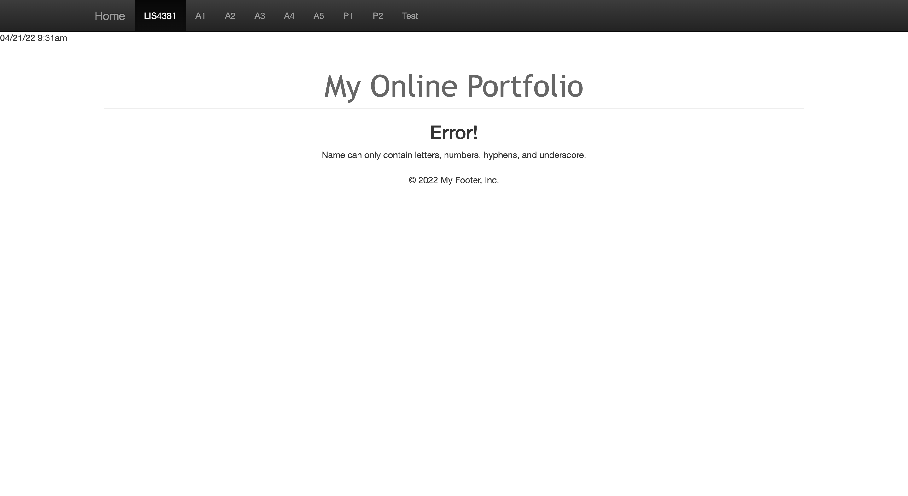
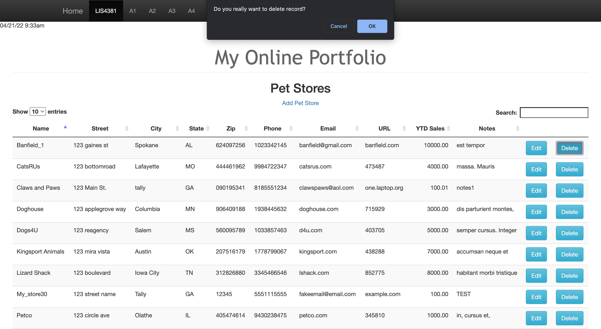
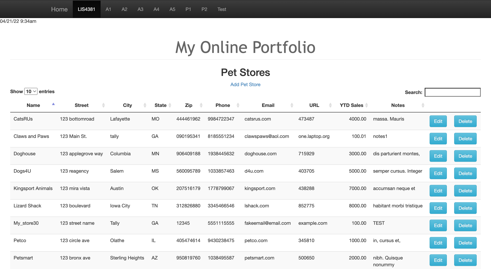
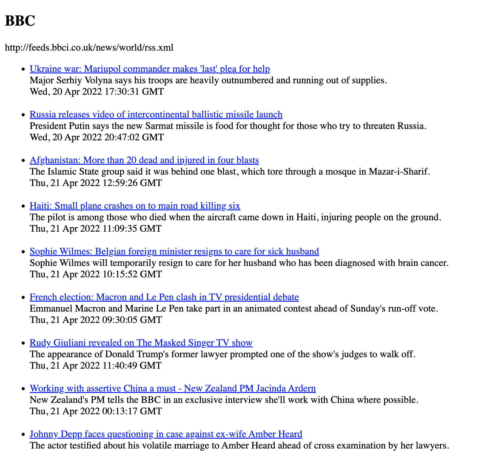

> **NOTE:** This README.md file should be placed at the **root of each of your repos directories.**
>
>Also, this file **must** use Markdown syntax, and provide project documentation as per below--otherwise, points **will** be deducted.
>

# LIS 4381 - Mobile Web App Development

## Ashton Uttayaya

### Project 2 Requirements:

*Three Parts:*

1. Add edit function to live database
2. Add delete function to live database
3. Create an RSS feed

#### README.md file should include the following items:

* Screenshot of homepage
* Screenshot of P2 index
* Screenshot of edit error and edit error message
* Screenshot of completed edit
* Screenshot of before and after delete
* Links to [Website](http://localhost:8080/lis4381)

#### Assignment Screenshots:

#### *Screenshots of home page.:

Home page                  |
:-------------------------:|
 |

#### *Screenshot of P2 index.:

P2 Index                   |
:-------------------------:|
 |

#### *Screenshots of edit error and error message.*:

Edit Error                 |  Error Message
:-------------------------:|:-------------------------:
  |  

#### *Screenshots of completed edit.:

Completed Edit             |
:-------------------------:|
 |

#### *Screenshots of before and after delete.*:

Before                     |  After
:-------------------------:|:-------------------------:
  |  

#### *Screenshots of RSS feed.:

RSS feed                   |
:-------------------------:|
 |